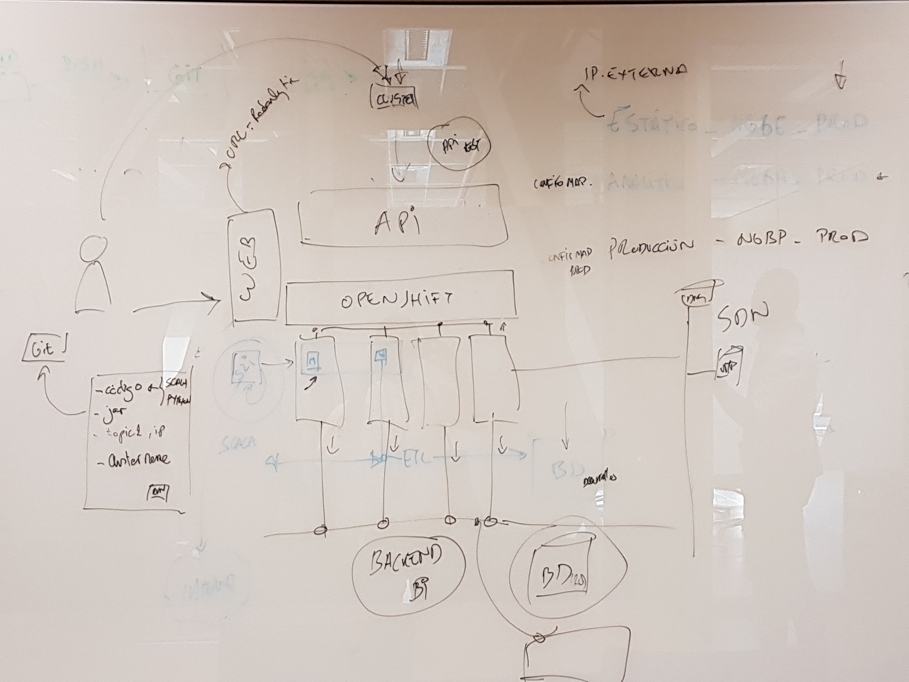
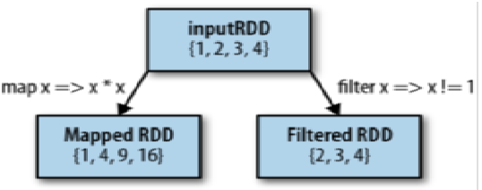
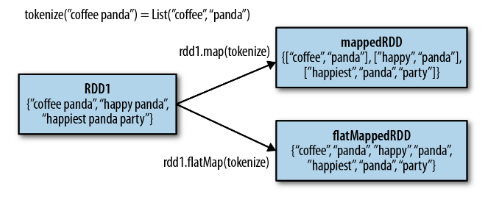

# Introducción
----


## Contexto

* Telefónica.
* Platafforma NGBI montada por Vaas.
* Soporte tercer nivel.



----
## Temario.

- Introducción y Conceptos Spark
- Montaje Stack nginx , Spark y Kafka para analisis
- Radanalytics.io (Spark + Openshift)

---

## Que es Spark?

* Es una plataforma de computación de proposito general.
* Cubre un amplio rango de cargas de trabajo
 * Procesos Batch
 * Algoritmos iterativos
 * Streaming
 * Consultas interactivas

Note:

* Extiende Mapreduce, con cosas como queries interactivas y proceso en streaming.
* Posibilidad e realizar computo en memoria.

---

## Componentes Spark


----

## Componentes Spark (II)

* Spark Core
* Spark SQL
* Spark Streaming
* Mlib
* GraphX
* Cluster Managers

Note:
* Stack unificado, Spark es motor de computo responsable de distribuir, monitorizar y agendar aplicaciones que consisten en varias tareas de computo entre diferentes nodos
* Estos nodos se llaman workers.
* El nodo que se encarga de saber  como está todo se llama Master.


----

## Spark Core

* Funcionalidad básica de Spark.
 * Scheduler
 * Gestion de memoria
 * Recuperación de errores
 * Interactución con los sistemas de almacenamiento.
 * Almacena la API que gestiona los RDD.

Note:
* Los RDD son la entidad principal de programación en Spark.
* Los RDD representan una colección de objetos distribuidos a traves de diferentes nodos de computación de tal manera que pueden ser manipulados en paralelo.


----

## Spark SQL

* Permite tabajar con datos estrucutados y consultarlo mediante SQL oo HQL.
* Se usa en conjunto con desarrollos contra las API's de Python, Java y Sacala.  
* Disponible desde 1.0 ha reemplazado a Shark.

Note:
* Shark es un proyecto que modifica Apache Hive para ejecutarse en Spark.

----

## Spark Streaming

* Permite procesar streams de datos en vivo.

Note:
* Logfiles desde webservers


----

## Mlib

* Libreria de Machine Learing.
* Soporta:
 * [Clasificacion](https://en.wikipedia.org/wiki/Statistical_classification)
 * [Regresion](https://es.wikipedia.org/wiki/Regresi%C3%B3n_lineal)
 * [Clustering](https://en.wikipedia.org/wiki/Cluster_analysis)
 * [Filtrado colaborativo](https://es.wikipedia.org/wiki/Filtrado_colaborativo).
* Permite evaluar modelos.
* Data import.

Notes:
* Clasificacion:  clasificacion por spam.
* Regresion: compra de casas.
* Clustering como pueden ser redes neuronales.
* Filtrado colaborativo: El filtrado colaborativo usa tecnicas que implican la colaboracion entre multiples agentes, fuentes de datos, etc.

----

## GraphX

* Libreria para manipular gráficos y crearlos directamente a partir de los RDD que hay en memoria.


----

## Cluster Managers

* Yarn
* Mesos
* StandAlone


---

## Usos de Spark

* Data Science.
* Aplicaciones de Proceso de datos.

---


## Capas de Almacenamiento de Spark.

* HDFS
* Sistema de archivos soportados por Hadoop.
* **No requiere Hadoop**

---

# Instalación

---

## Descarga

* https://spark.apache.org/downloads.html
* Ultima release 2.3.1
* Spark Console

```
# bin/pyspark
```

Note:
* Readme.md
* bin .
* core, streaming, python .
* examples.
* Lanzar consola Spark.


```
>>> lines = sc.textFile("README.md") # Create an RDD called lines
>>> lines.count() # Count the number of items in this RDD
127
>>> lines.first() # First item in this RDD, i.e. first line of README.md u'# Apache Spark'
```

----

## Conceptos de Spark


 * El driver accede a Spark a traves de un objeto llamado SparkContext.
 * SparkContext: Objeto a través del cual se accede a Spark.
 * Executores: Nodos en los que se ejecutan las operaciones que se definen en el driver.


Note:
* El driver contiene el programa principal y define los conjuntos de datos
* En la consola el SparkContext es la consola en si misma.

* Ejecutar en la consola

```
>>> sc
```

----


## Conceptos de Spark

 


Note:

* Mucho de la API de Spark se basa en pasar funciones a sus operadores para que se ejecuten en el cluster. Esto se suele hacer mediante funciones lambda o el operador => en Scala.

```
>>> lines = sc.textFile("README.md")
>>> pythonLines = lines.filter(lambda line: "Python" in line)
>>> pythonLines.first()
```

```
def hasPython(line):
    return "Python" in line
pythonLines = lines.filter(hasPython)
```

---

# Aplicaciones en StandAlone.

* La principal diferencia es inicializar el SparkContext.
* Java y Scala se añade una dependecia del spark-core:

```
groupId = org.apache.spark
artifactId = spark-core_2.10
version = 1.3.0
```

* En Python se escribe un script.
```
bin/spark-submit test.py
```

----

## Inicialización del Spark Context.

* Python

```
from pyspark import SparkConf , spark_driver_context_workers
conf = SparkConf().setMaster("local").setAppName("My App")
sc = SparkContext(conf = conf)
```
* Scala

```
import org.apache.spark.SparkConf
import org.apache.spark.SparkContext
import org.apache.spark.SparkContext._
val conf = new SparkConf().setMaster("local").setAppName("My App") val sc = new SparkContext(conf)
```

Note:

* En la forma minima, se pasa el nombre del cluster y un nombre de aplicación
* Hay parametros adicionales, por ejemplo para modificar como se ejecuta la aplicación.
* Para para Spark, o se llama al método stop() en el SC, simplemente se termina la aplicación con un exit.

---


# Programacion con RDD
----
## Operaciones elementales.

* Es una colección de objetos inmutable y distribuida.
* Tiene dos tipos de operaciones
 * Transformaciones
```
>>> pythonLines = lines.filter(lambda line: "Python" in line)
```
 * Acciones.
```
>>> pythonLines.first()
u'## Interactive Python Shell'
```

Note:
* Los RDD solo son computados de manera vaga, es decir, sólo se usan la primera vez que son llamadas en una acción.
* Se crean o cargandolo de una fuente externa o mediante un conjunto de datos en el driver, como puede ser una lista.
* Cada RDD se parte en diferentes partes y se reparte entre los workers.
* Los RDD son recalculados cada vez que se realiza una acción sobre ellos.
* En la practica se usa un metodo que es persist() para realizar varias consultas sobre ese subconjunto de datos.
* Cuando significa que cuando se llama a la transformación de un RDD, la operación no se realiza inmediatamente, sino que Spark registra que la operación ha sido solicitada. De esta forma Spark reduce el numero de pasos que hay que dar sobre los datos.

En la practica.
1. Create some input RDDs from external data.
2. Transform them to define new RDDs using transformations like filter().
3. Ask Spark to persist() any intermediate RDDs that will need to be reused.
4. Launch actions such as count() and first() to kick off a parallel computation,which is then optimized and executed by Spark.

----

## Paso de funciones a Spark (Python).

* funciones lambda
* Funciones definidas localmente
* Funciones de alto nivel

```
>>> word = rdd.filter(lambda s: "error" in s)

def containsError(s):
  return "error" in s
word = rdd.filter(containsError)

```

Note:
* No hacer cosas como:
```
class SearchFunctions(object):
  def __init__(self, query):
    self.query = query
  def isMatch(self, s):
    return self.query in s
  def getMatchesFunctionReference(self, rdd):
    # Problem: references all of "self" in "self.isMatch"
    return rdd.filter(self.isMatch)
  def getMatchesMemberReference(self, rdd):
    # Problem: references all of "self" in "self.query"
    return rdd.filter(lambda x: self.query in x)
```

- Mejor sacar los campos que se necesitan del objeto a una variable y pasarlo en el

```
class WordFunctions(object):
    ...
    def getMatchesNoReference(self, rdd):
        # Safe: extract only the field we need into a local variable
        query = self.query
        return rdd.filter(lambda x: query in x)
```


----

### Transformaciones referidas a elementos.

* map y filter

* flatmap



Note:

* Map no tiene porque devolver el mismo tipo que el tipo de entrada.
```
nums = sc.parallelize([1, 2, 3, 4])
squared = nums.map(lambda x: x * x).collect()
for num in squared:
    print "%i " % (num)

```
* flatmap --> Cuando se quieren producir multiples elementos de salida por cada elemento de entrada usamos flatmap.
```
lines = sc.parallelize(["hello world", "hi"])
words = lines.flatMap(lambda line: line.split(" "))
words.first() # returns "hello"s
```
----

### Operaciones con conjuntos

* Union , Intersecciones ...
* Todos los RDD del mismo tipo.
*
Note:

* La operación de distinct es muy cara, porque tiene que enviar todos los datos por la red.
* union
* intersection --> mucho más cara que union.  
* substract()
* cartesian()

Funcion|Descripcion|Ejemplo|Resultado
map()|Apply a function to each element in the RDD and return an RDD of the result.|rdd.map(lambda x: x + 1)|{2,3,4,4}
flatMap()|Apply a function to each element in the RDD and return an RDD of the contents of the iterators returned. Often used to extract words.|rdd.flatMap(lambda x:  x**3) |{1,2,3,2, 3, 3, 3}
filter()|Return an RDD consisting of only elements that pass the condition passed tofilter().|rdd.filter(x => x != 1)|{2, 3, 3}
distinct()|Remove duplicates.|{1, 2, 3}
sample(withRe placement, frac tion, [seed])|Sample an RDD, with or without replacement.|rdd.distinct() rdd.sample(false, 0.5)|Nondeterministic

----

### Acciones

* reduce
```
sum = rdd.reduce(lamda x,y: x + y )
```

----

### Persistencia  

| Level | Space Used | CPU Time | In Memory | On Disk |
| MEMORY_ONLY | H | L | Y | N |
| MEMORY_ONLY_SER | L | H | Y  | N |
| MEMORY_AND_DISK | H | M | Some | Some |
| MEMORY_AND_DISK_SER | L | H | Some | some |
| DISK_ONLY | L | H | N | Y |

```
import org.apache.spark.storage.StorageLevel val result = input.map(x => x * x) result.persist(StorageLevel.DISK_ONLY) println(result.count()) println(result.collect().mkString(","))
```

---

# Ejercicios

* Desde ficheros de log servidor web, sacar errores 404
* Desde una lista de datos de temperaturas en fahrenheit, convertir a Celsius
* Sacar la union de dos listas de enteros

---

# Spark en Cluster

* spark-submit


Note:

- se envia la app
- se lanza el driver invocando a main()
- el driver le pide al master recursos
- Se lanzan los ejecutores por el master
- El driver se ejecuta y envia el trabajko a los ejecutores en forma de tareas
- si el driver sale o se llama a stop() se liberan los recursoso desde el cluster manager.

* mirar en el libro los parametros que se le pueden pasarl


----


## Componentes de la ejecucion

* Jobs
* Tasks
* Stages


----

Maquinas

| usuario| master        | worker         |  
| alicia | 172.20.126.13 | 172.20.126.186 |  
| carlos | 172.20.126.183| 172.20.126.184 |  
| juan   | 172.20.127.97 | 172.20.126.177 |
| david  | 172.20.126.178| 172.20.126.181 |
| natalia| 172.20.127.95 | 172.20.126.182 |
| juanma | 172.20.126.179| 172.20.126.180 |


---

# Spark SQL

* Permite trabajar con datos structurados y semiestructurados.
- Provee abstracción en todas las API que permite trabajar con datasets estructurados.
- Puede leer y escribir datos en multiples formatos
- Permite usar SQL para interrogar datos.


Note:

* Formatos como Hive, Json y Parquet.
* Puede usar conectores como JDBC/ODBC o herramientas de BI como Tableau.
* Por debajo, se basa en una extensión de RDD que se llaman Dataframes.

----

## Dataframes.

* Se componen de un RDD de Row objects.
* Conocen el esquema


Note:

* Cada Row object representa un registro.
* Al conocer el esquema, proveen operaciones que un Dataframe nativo no puede dar, como la posibilidad de ejecutar consultas SQL.

---

## Enlazar Spark con Spark SQL.

* Usar Spark SQL requiere dependencias adicionales.
* El lenguage recomendado para trabajar con Spark SQL es HQL (HiveContext), la alternativa es trabajar con SQLContext.


---


Rendimiento Spark .
https://spoddutur.github.io/spark-notes/distribution_of_executors_cores_and_memory_for_spark_application.html
