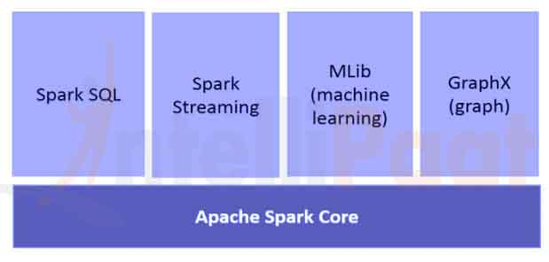
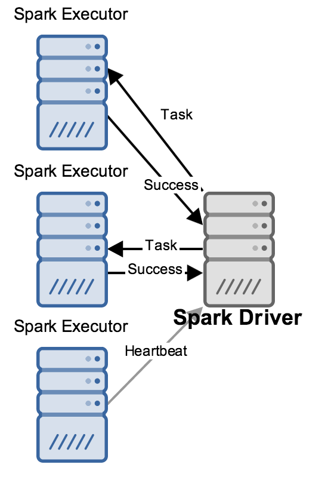

# Introducción

---

## Que es Spark?

* Es una plataforma de computación de proposito general.
* Cubre un amplio rango de cargas de trabajo
 * Procesos Batch
 * Algoritmos iterativos
 * Streaming
 * Consultas interactivas

Note:
test note

---

## Componentes Spark



----

## Componentes Spark (II)

* Spark Core
* Spark SQL
* Spark Streaming
* Mlib
* GraphX
* Cluster Managers

Note:
* Stack unificado, Spark es motor de computo responsable de distribuir, monitorizar y agendar aplicaciones que consisten en varias tareas de computo entre diferentes nodos
* Estos nodos se llaman workers.
* El nodo que se encarga de saber  como está todo se llama Master.


----

## Spark Core

* Funcionalidad básica de Spark.
 * Scheduler
 * Gestion de memoria
 * Recuperación de errores
 * Interactución con los sistemas de almacenamiento.
 * Almacena la API que gestiona los RDD.

Note:
* Los RDD son la entidad principal de programación en Spark.
* Los RDD representan una colección de objetos distribuidos a traves de diferentes nodos de computación de tal manera que pueden ser manipulados en paralelo.


----

## Spark SQL

* Permite tabajar con datos estrucutados y consultarlo mediante SQL oo HQL.
* Se usa en conjunto con desarrollos contra las API's de Python, Java y Sacala.  
* Disponible desde 1.0 ha reemplazado a Shark.

Note:
* Shark es un proyecto que modifica Apache Hive para ejecutarse en Spark.

----

## Spark Streaming

* Permite procesar streams de datos en vivo.

Note:
* Logfiles desde webservers


----

## Mlib

* Libreria de Machine Learing.
* Soporta:
 * [Clasificacion](https://en.wikipedia.org/wiki/Statistical_classification)
 * [Regresion](https://es.wikipedia.org/wiki/Regresi%C3%B3n_lineal)
 * [Clustering](https://en.wikipedia.org/wiki/Cluster_analysis)
 * [Filtrado colaborativo](https://es.wikipedia.org/wiki/Filtrado_colaborativo).
* Permite evaluar modelos.
* Data import.

Notes:
* Clasificacion:  clasificacion por spam.
* Regresion: compra de casas.
* Clustering como pueden ser redes neuronales.
* Filtrado colaborativo: El filtrado colaborativo usa tecnicas que implican la colaboracion entre multiples agentes, fuentes de datos, etc.

----

## GraphX

* Libreria para manipular gráficos y crearlos directamente a partir de los RDD que hay en memoria.


----

## Cluster Managers

* Yarn
* Mesos
* StandAlone


---

## Usos de Spark

* Data Science.
* Aplicaciones de Proceso de datos.

---


## Capas de Almacenamiento de Spark.

* HDFS
* Sistema de archivos soportados por Hadoop.
* **No requiere Hadoop**

---

# Instalación

---

## Descarga

* https://spark.apache.org/downloads.html
* Ultima release 2.3.1
* Spark Console

```
# bin/pyspark
```

Note:
* Readme.md
* bin .
* core, streaming, python .
* examples.
* Lanzar consola Spark.


```
>>> lines = sc.textFile("README.md") # Create an RDD called lines
>>> lines.count() # Count the number of items in this RDD
127
>>> lines.first() # First item in this RDD, i.e. first line of README.md u'# Apache Spark'
```

----

## Conceptos de Spark


 * El driver accede a Spark a traves de un objeto llamado SparkContext.
 * SparkContext: Objeto a través del cual se accede a Spark.
 * Executores: Nodos en los que se ejecutan las operaciones que se definen en el driver.


Note:
* El driver contiene el programa principal y define los conjuntos de datos
* En la consola el SparkContext es la consola en si misma.

* Ejecutar en la consola

```
>>> sc
```

----


## Conceptos de Spark

 


Note:

* Mucho de la API de Spark se basa en pasar funciones a sus operadores para que se ejecuten en el cluster. Esto se suele hacer mediante funciones lambda o el operador => en Scala.

```
>>> lines = sc.textFile("README.md")
>>> pythonLines = lines.filter(lambda line: "Python" in line)
>>> pythonLines.first()
```

```
def hasPython(line):
    return "Python" in line
pythonLines = lines.filter(hasPython)
```

---

# Aplicaciones en StandAlone.

* La principal diferencia es inicializar el SparkContext.
* Java y Scala se añade una dependecia del spark-core:

```
groupId = org.apache.spark
artifactId = spark-core_2.10
version = 1.3.0
```

* En Python se escribe un script.
```
bin/spark-submit test.py
```

----

## Inicialización del Spark Context.

* Python

```
from pyspark import SparkConf , spark_driver_context_workers
conf = SparkConf().setMaster("local").setAppName("My App")
sc = SparkContext(conf = conf)
```
* Sacala

```
import org.apache.spark.SparkConf
import org.apache.spark.SparkContext
import org.apache.spark.SparkContext._
val conf = new SparkConf().setMaster("local").setAppName("My App") val sc = new SparkContext(conf)
```


Note:

* En la forma minima, se pasa el nombre del cluster y un nombre de aplicación
* Hay parametros adicionales, por ejemplo para modificar como se ejecuta la aplicación.
* Para para Spark, o se llama al método stop() en el SC, simplemente se termina la aplicación con un exit.

---


Rendimiento Spark .
https://spoddutur.github.io/spark-notes/distribution_of_executors_cores_and_memory_for_spark_application.html
